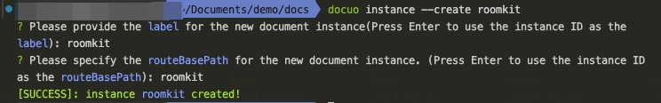

# Docs Multi-instance

## Use-cases

Sometimes you want a Docuo site to host 2 distinct sets of documentation (or more).

These documentations may even have different versioning.

### Mobile SDKs documentation

If you build a cross-platform mobile SDK, you may have 2 documentations:

- Android SDK documentation (v1.0, v1.1)
- iOS SDK documentation (v1.0, v2.0)

In this case, you can use a distinct docs instance per mobile SDK documentation.
Each instance has its own configuration and entity files.

<Warning title="WARNING">
If each documentation instance is very large, you should rather create 2 distinct Docuo sites.
</Warning>

## Setup

You can configure multiple instances in the following two ways:

### Using the command line

Manage the instance directly using the [Docuo provided command line](../../Getting%20started/Development.mdx#docuo-instance).

```
docuo instance --create callkit
```

<Frame width="auto" height="auto" >
  
</Frame>

### By manual configuration

Create a new document instance by following these steps:

1. Add instance configuration in the instances field, see [Customize with json file](../../Customizing/Customize%20with%20json%20file.mdx#instances) for details.
2. Add the entity document directory corresponding to the instance, the directory structure is the same as the default doc directory.

Here the new instance is created. As for how to display the new instance on the page, you can refer to [Customize with json file](../../Customizing/Customize%20with%20json%20file.mdx#navbar-items).