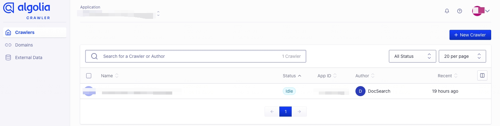
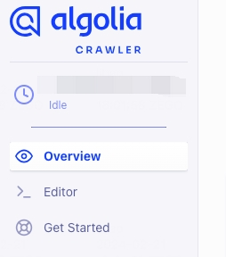
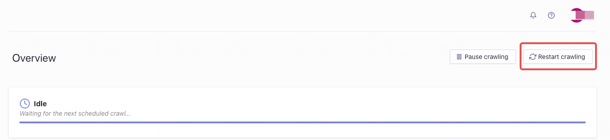

# Search

## Using Algolia DocSearch

Docuo has official support for [Algolia DocSearch](https://docsearch.algolia.com/).

The service is free for any developer documentation or technical blog: just make sure to read the [checklist](https://docsearch.algolia.com/docs/who-can-apply/) and [apply to the DocSearch program](https://docsearch.algolia.com/).

DocSearch crawls your website once a week (the schedule is configurable from the web interface) and aggregates all the content in an Algolia index. This content is then queried directly from your front-end using the Algolia API.

If your website is [not eligible](https://docsearch.algolia.com/docs/who-can-apply/) for the free, hosted version of DocSearch, or if your website sits behind a firewall and is not public, then you can [run your own](https://docsearch.algolia.com/docs/legacy/run-your-own/) DocSearch crawler.

<Note title="NOTE">
By default, the Docuo preset generates a [sitemap.xml](https://docuo.spreading.io/sitemap.xml) that the Algolia crawler can use.
</Note>

<Tip title="FROM THE OLD DOCSEARCH?">
You can read more about migration from the legacy DocSearch infra [in the DocSearch migration docs](https://docsearch.algolia.com/docs/migrating-from-legacy/).
</Tip>

### Index Configuration
After your application has been approved and deployed, you will receive an email with all the details for you to add DocSearch to your project. Editing and managing your crawls can be done via [the web interface](https://crawler.algolia.com/). Indices are readily available after deployment, so manual configuration usually isn't necessary.

### Modifying Crawler Configuration
Next you need to modify the crawl configuration as follows to ensure that you can crawl to all pages of your site.

1. Log in to [crawlers background](https://crawler.algolia.com/admin/crawlers).
2. Select the corresponding crawler.
<Frame width="auto" height="auto" >
  
</Frame>
3. Go to Editor page
<Frame width="auto" height="auto" >
  
</Frame>
4. Enter the sitemap file address, which is "YOUR DOMAIN/sitemap.xml".
<Frame width="auto" height="auto" >
  
</Frame>
5. Crawling the page again.
<Frame width="auto" height="auto" >
  
</Frame>

### Connecting Algolia

Add an algolia field in your search. Apply for DocSearch to get your Algolia index and API key.

<CodeGroup>

```json docuo.config.json
{
  // ...
  "search": {
    "algolia": {
      "appId": "YOUR_APP_ID",
      "apiKey": "YOUR_API_KEY",
      "indexName": "YOUR_INDEX_NAME"
    }
  }
}
```

</CodeGroup>

<Warning title="WARNING">
The search feature will not work reliably until Algolia crawls your site.

If search doesn't work after any significant change, please use the Algolia dashboard to trigger a new crawl.
</Warning>

