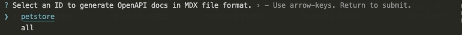

# Website

This website is built using [Docuo](https://app.spreading.ai/home), a modern static website generator.

## Development

Preview changes locally.

### Installation

Download the Docuo CLI.

```
npm i -g @spreading/docuo
```

### Commands

Run the below commands at the root of your Docuo project.

#### `docuo dev`

Run this command to preview changes locally.

##### Custom Ports

Docuo uses port 3000 by default. You can use the `--port` flag to customize the port. For example, use this command to run in port 3333:

```
docuo dev --port 3333
```

#### `docuo build`

Run this command to check if there were any build error. Fix them and commit your changes to remote repository.

#### `docuo clear`

Run this command to remove local build template cache.
When you run `docuo dev` for the first time, the build template will be cloned and cached locally.
As a result, next time you run `docuo dev` will be faster, but the build template is probably out of date.
So if your local website doesn’t align with the production version, please run this command before you run `docuo dev`.

#### `docuo version`

Run this command to creating or deleting a specified version in the corresponding document instance.

##### Options

| Name         | Default     | Required | Description                                                  |
| ------------ | ----------- | -------- | ------------------------------------------------------------ |
| `--create`   | `undefined` | `true`   | Create a new version.                                        |
| `--delete`   | `undefined` | `true`   | Delete specified version, enter the confirmation button as prompted. |
| `--instance` | `default`   | `false`  | Specifies the document instance of the version to operate on, or uses the default document instance if not specified. |

#### `docuo instance`

Run this command to creating or deleting the specified document instance.

##### Options

| Name       | Default     | Required | Description                                                  |
| ---------- | ----------- | -------- | ------------------------------------------------------------ |
| `--create` | `undefined` | `true`   | A combination of lowercase letters, digits, and underscores is supported.<br />Create a new document instance, you need to be prompted for the values of each option.<br />`label`: The default is instance id<br />`routeBasePath`: The default is instance id<br /> |
| `--delete` | `undefined` | `true`   | Delete specified document instance, enter the confirmation button as prompted. |

#### `docuo gen-openapi-docs`

Run this command to generate the corresponding mdx documentation according to the specified `OpenAPI` documentation.

This command needs to be used in conjunction with the `openapi` parameter in `docuo.config.json`.

The input command will display a list of openapi documents, identified by the `id`. Select the corresponding `id`. The docuo document will be generated internally according to the corresponding `id` configuration.



<Note>
`all` is the internal default, indicating that all documents are generated based on all configurations.
</Note>

[OpenAPI configuration](../Using%20OpenAPI/Setup%20OpenAPI.mdx) is as follows:

<CodeGroup>
 
```json docuo.config.json
{
  "openapi": {
    "id": {
      "specPath": "docs/Using OpenAPI/OpenAPI Demo/petstore.yaml",
      "outputDir": "docs/Using OpenAPI/OpenAPI Demo"
    }
  }
}
```

</CodeGroup>

#### `docuo clean-openapi-docs`

Run this command to clears the specified `OpenAPI` mdx documentation.

This command needs to be used in conjunction with the `openapi` parameter in `docuo.config.json`.

The input command will display a list of openapi documents, identified by the `id`. Select the specified `id` to clear.


<Note>
`all` is the internal default, indicating clear all.
</Note>

[OpenAPI configuration](../Using%20OpenAPI/Setup%20OpenAPI.mdx) is as follows:

<CodeGroup>
 
```json docuo.config.json
{
  "openapi": {
    "id": {
      "specPath": "docs/Using OpenAPI/OpenAPI Demo/petstore.yaml",
      "outputDir": "docs/Using OpenAPI/OpenAPI Demo"
    }
  }
}
```

</CodeGroup>

## Deployment

### Automatically

Install our Github App and turn on the "Auto update" switch on the [Setting page](https://app.spreading.ai/workspace/setting/). Changes will be deployed to production automatically after pushing to the default branch.

### Manually

Click the "Tigger update" button on the [Home page](https://app.spreading.ai/home) to update your project.