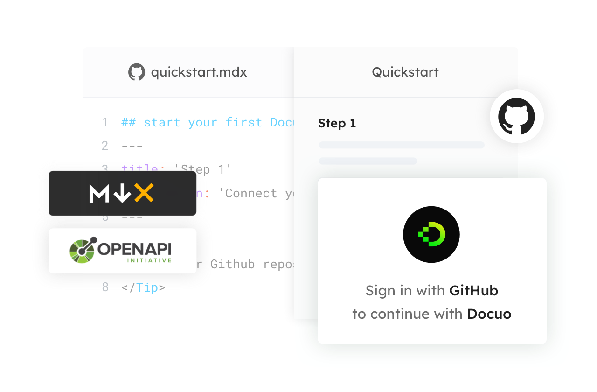
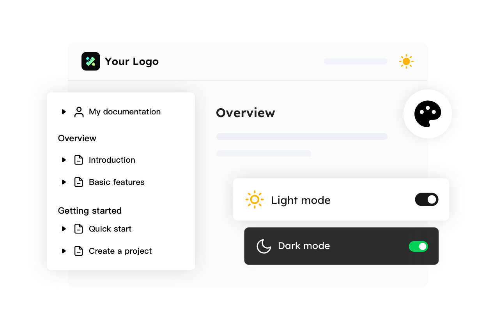

# Quickstart

> You can seamlessly launch your docs sites following 4 steps below.

## Step1 Connect your contents

To start your project, you'll link your Github repository, and leverage the MDX, OpenAPI documents for website generation, while keeping the contents live alongside your codebase.

For more information, please check [Set up your first project](./Set%20up%20your%20first%20project.mdx) for more information.

<Frame width="auto" height="auto" >
  
</Frame>

## Step2 Customize your website

Elevate brand identity on your docs website by setting your logo & brand colors. You can also configure the site navigation, footer and docs sidebar to make your website more personalized.

<Frame width="auto" height="auto" >
  
</Frame>

## Step3 Publish your website

Deploy your docs website with a single click, or update automatically after editing the content. From editor to https just in seconds, deploy once, deliver everywhere.

<Frame width="auto" height="auto" >
  
</Frame>

## Step4 Engage your users

Configure the SEO metadata for your website and articles to expand your traffic, bridging the gap between your knowledge base and end-users.

<Frame width="auto" height="auto" >
  
</Frame>
