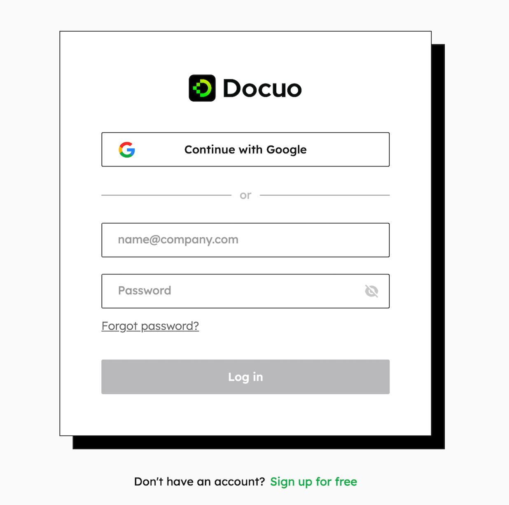
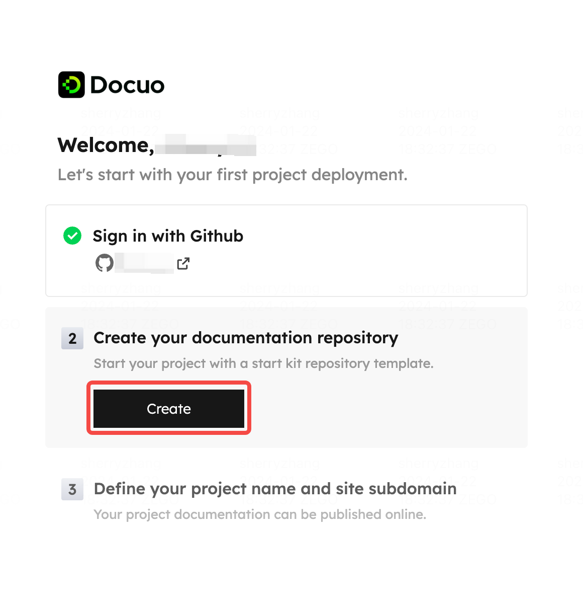
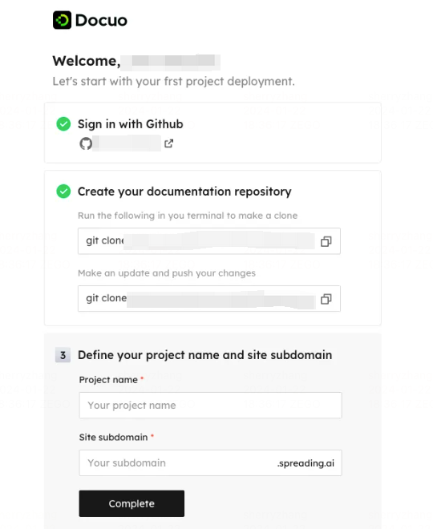

# Set up your first project

> In this section, you will get detailed guides that help you create your first docs website project.

If you are just getting started with Docuo, we recommended you read this guide in detail ,and review each section in order. 
If your first project has been set up, feel free to jump to the section that works best for you!

## Sign in with Docuo account
To get started with Docuo, you need to [create a personal account](https://app.spreading.ai/signup/) and verify your email address. You can also directly sign up with your Google account.
If you have already signed up with an account, [log in](https://app.spreading.ai/login) to continue with Docuo!

<Frame width="auto" height="auto" >
  
</Frame>

## Onboarding process

1. Authorize Github
We use Github as your docs repository source. All your docs will be stored and managed on your Github.

* Sign in with Github account
Hit "Sign in with Github" to Connect your Github account first. If you don't have a Github account, create an account.

* Authorize OAuth app
Next, authorize our OAuth app. This ensures getting your Github repositories and publishing your content to the website. 

<Frame width="auto" height="auto" >
  
</Frame>

2. Clone template repository to your Github
On the next step, you'll create your first repository for your project. We've prepared template repository for you. This will help you get started faster and edit content you want to publish with ease.
Hit "Create", Docuo public template repository will be cloned to your own Github， which you can find in your git repository list.
After successfully cloning the template repository, we also prepare updating guide for you. 

<Frame width="auto" height="auto" >
  
</Frame>

3. Set your project name and site subdomain

The last step is to define your project name and site subdomain. We will help you apply for your docs website domain. Type in your project name, and the subdomain will be automatically filled in. You can re-enter the subdomain you like.  Then hit "Complete" to finish set up process.

<Frame width="auto" height="auto" >
  
</Frame>

*If your requested subdomain is taken, you'll get an error message. Please email **mailto:docuo@spreading.ai** to check if it is an active account, or if we can free up the subdomain for you.*

## Visit your first project website

Once you've successfully set up your project, you will enter your project homepage. You can see the basic information of your project on the homepage, including project name, associated Github repository, site link and site preview page. The website is in publishing status when you first enter the homepage, which will take 1-2 minutes.

After the site is successfully published, you can click the site link on the homepage to access your initialization docs website built from the template repository content. 