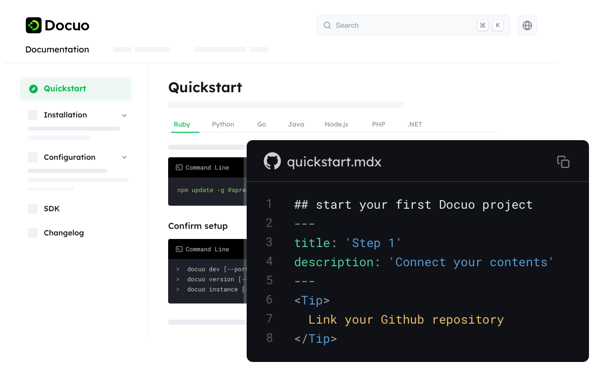
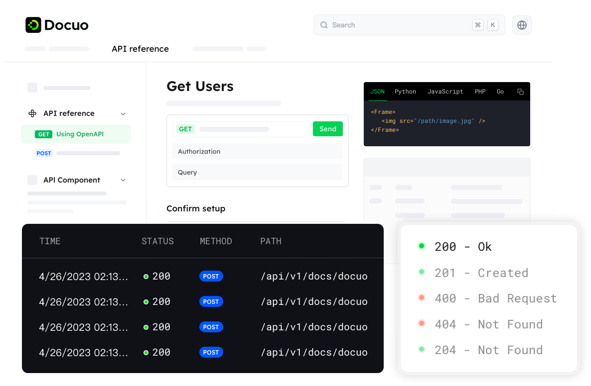

# Introduction

## Welcome

Welcome to your first documentation homepage.

Docuo is a lightweight platform that can seamlessly convert your static content into dynamic and modern developer hub, API reference, product guides, and other varieties of docs sites.

<Frame width="auto" height="auto" >
  
</Frame>

<Tip title="What you can do">You can use Docuo platform to effortlessly transforms your static contents into a modern developer hub, API reference, product guides, and more.</Tip>

## Use cases

Docuo supports helping users to quickly generate different kinds of technical websites, helping companies to engage more end users.

* Developer hub
<Frame width="auto" height="auto" >
  
</Frame>

* API reference
<Frame width="auto" height="auto" >
  
</Frame>

* Product guides
<Frame width="auto" height="auto" >
  
</Frame>